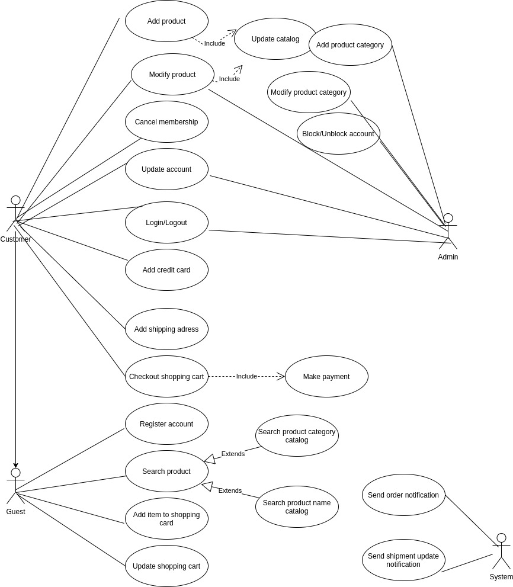
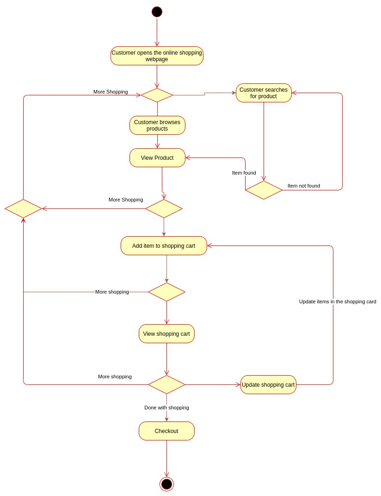

# Amazon
### The world's largest online retailer.

### Requirements and Goals of the System 

1. Users should be able to add new products to sell.
2. Users should be able to search for products by their name or category.
3. Users can search and view all the products, but they will have to become a registered member to buy a product.
4. Users should be able to add/remove/modify product items in their shopping cart.
5. Users can check out and buy items in the shopping cart.
6. Users can rate and add a review for a product.
7. The user should be able to specify a shipping address where their order will be delivered.
8. Users can cancel an order if it has not shipped.
9. Users should get notifications whenever there is a change in the order or shipping status.
10. Users should be able to pay through credit cards or electronic bank transfer.
11. Users should be able to track their shipment to see the current state of their order.

### Use Case
#### Main actors
 - Admin: Account management and adding or modifying new product categories.
 - Guest: Search the catalog, add/remove items to the shopping cart, as well as become registered members.
 - Member: Can perform all the activities that guests can, in addition to which, they can place orders and add new products to sell.
 - System: Sending notifications for orders and shipping updates.

#### Use Case Diagram
 

 ### Class 
 - Account
 - Guest
 - Catalog
 - ProductCategory
 - Product
 - ProductReview
 - ShoppingCart
 - Item
 - Order
 - OrderLog
 - ShipmentLog
 - Notification
 - Payment

 #### Class Diagram
 

### Acitivity
User performing online shopping

#### Activity Diagram

### Sequence

#### Searching the catalog

#### Add item to the shopping cart

#### Place an order

